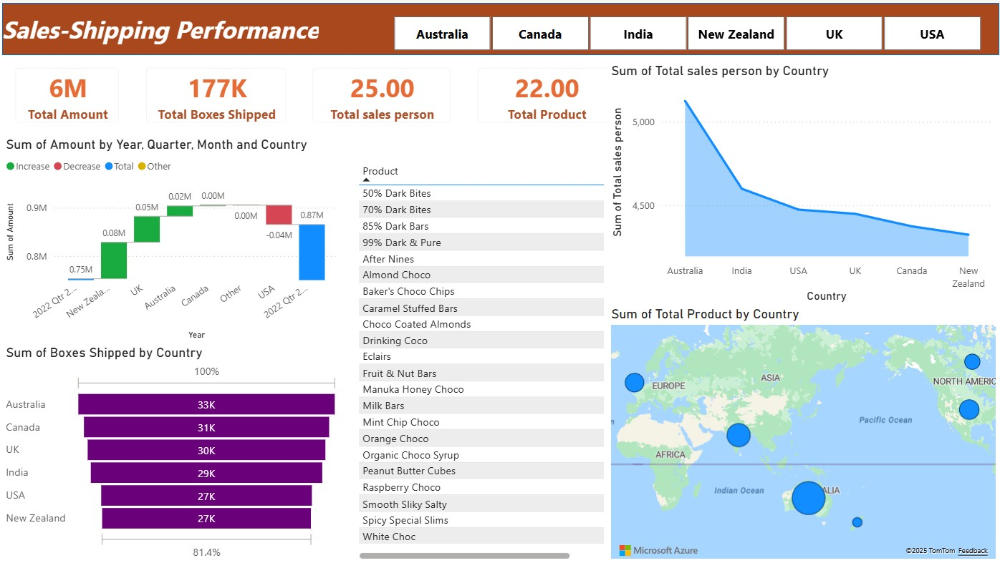

# 📊 Data Analytics Portfolio — Why Dashboard Design Matters: My Approach to Power BI and Tableau Sales Analytics

Welcome to my Data Analytics Portfolio!  
This repository showcases my analytical projects built using **Power BI**, **Tableau**, and **Essential/Superstore datasets**, highlighting my skills in dashboard design, data modeling, storytelling, and business insight generation.

## 👩‍💻 About Me

Hello! I'm **Upama Shahani**, currently pursuing my **M.Sc. in Disaster Management at KUET**.  
I completed my **B.Sc. in Civil Engineering** from the University of Rajshahi.

I am passionate about:

- 🌪 Forecasting & Predictive Modeling  
- 📊 Data Analysis related to vulnerability zones  
- 🛡 Risk Assessment & Mitigation Strategies  
- 🎨 Dashboard Design & Visualization  
- 🖼 Graphic Design (personal interest)

I also hold a **Professional Certificate in Business Data Analytics** from **Brit College of Engineering & Technology (BCET), UK**.

# 📈 Portfolio Projects - How I Designed Two High-Impact Sales Dashboards Using Power BI and Tableau
Data visualization is no longer just a technical task — it has become one of the most essential skills for presenting business insights clearly, quickly, and visually. Whether you’re analyzing sales performance, shipping efficiency, or customer trends, a well-built dashboard can transform raw numbers into real decisions.

In this post, I’m sharing two dashboards I created using Power BI and Tableau. Both dashboards focus on sales analytics, but each follows a different visualization philosophy. Power BI delivers a KPI-driven, business-style interface, while Tableau highlights storytelling and trend analysis.

Let’s walk through both dashboards, the design logic behind them, and what insights they bring to decision-makers.

## 🚀 **Project 1 — Diet Coke Sales Dashboard (Power BI)**

### 🖼️ Project Screenshot  

### 🔹 Key Findings
- **Total Revenue:** 107K  
- **Units Sold:** 189K  
- **Avg Price/Unit:** $0.56  
- **Trend:** Revenue increases from Jan → Jul, dips in Sept–Oct, rises again in Dec  
- **Top State:** California

### 🔹 Skills Applied
- Time-series trend analysis  
- Map visualization  
- KPI card design  
- Retail sales analytics  

## 🚀 **Project 2 — Sales & Shipping Performance Dashboard (Power BI)**

### 🖼️ Project Screenshot  

### 🔹 Highlights
- **Total Sales:** 6M  
- **Boxes Shipped:** 177K  
- **Salespersons:** 25  
- **Products:** 22  

### 🔹 Insights
- Growth in NZ, UK, Australia  
- USA shows slight decline  
- Shipping leader: **Australia (33K)**  
- Global product reach  
- Highest salesperson count in Australia (~5,200)

### 🔹 Skills Applied
- DAX measures  
- Waterfall comparison  
- Market & shipping segmentation  
- Geographic analytics  

## 🚀 **Project 3 — Global Superstore Dashboard (Tableau)**

### 🖼️ Project Screenshot  

### 🔹 Key Insights
- **Top Category:** Technology  
- Sales: Technology (~750K), Furniture (~700K), Office Supplies (~650K)  
- Best Subcategories: Chairs, Tables, Binders  
- Highest regional sales: California & Northeast USA  
- Discount peaks at **30.10%**

### 🔹 Skills Used
- Multi-chart dashboards  
- Category/subcategory analytics  
- Geo heat maps  
- Discount trend analysis  

# 🔗 Published Dashboards

### 📌 **Tableau Dashboard**
🔗 https://public.tableau.com/views/SalesDataAnalysis_17643866392570/SalesDasshboard

### 📌 **Power BI Dashboard**
🔗 https://app.powerbi.com/groups/me/lineage?experience=power-bi

# 🌐 Profile Links

### 🔵 **LinkedIn**
https://www.linkedin.com/posts/upama-shahani-b68bb4205_tableaudashboard-dataanalysis-datavisualization-activity-7400874830595801088-sEeh

### 📝 **Medium Article**
https://medium.com/@upamashahani00/why-dashboard-design-matters-my-approach-to-power-bi-and-tableau-sales-analytics-ff143c51f785

### 🟣 **GitHub Portfolio**
https://github.com/upama00-cpu/Data-Analysis-project

# 🧠 Key Learnings & Conclusions

### ✔️ **KPI-First Design**
### ✔️ **Clean Visual Structure**
### ✔️ **Deep Comparative Analysis**
### ✔️ **Geographic Storytelling**
### ✔️ **Using Tools for their Strengths**

# 📬 Contact

📧 Email: **upamashahani00@gmail.com**  
📱 WhatsApp: **01630808245**

✨ *Thank you for visiting my portfolio!*  
Let's connect and collaborate on data-driven projects.

